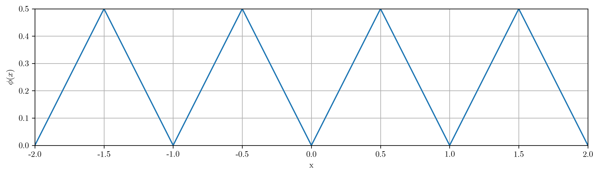

+++
title = "An intuitive exploration of the Ferrera–Gómez Generalized Takagi Class"
date = 2025-08-23T23:39:22+02:00
draft = false
description = "A step-by-step and intuitive approach to the Ferrera–Gómez Generalized Takagi Class, exploring how simple definitions can conceal remarkably intricate behavior in mathematical functions."
tags = ["mathematics", "real-analysis", "takagi-function", "pathological-functions", "continuity", "differentiability"]
categories = ["mathematics", "analysis"]
math = true
featured_image = "/images/takagi-thumbnail.png"
summary = "Explore the fascinating world of the Ferrera–Gómez Generalized Takagi Class through an intuitive approach that reveals how simple definitions can conceal remarkably intricate mathematical behavior."
+++
<!-- Contenido -->

## Prologue

The Takagi function, introduced in 1903, has long stood as a striking example of how simple definitions can conceal remarkably intricate behavior. Constructed from the triangular wave and famously continuous yet nowhere differentiable, it serves as a cornerstone in the study of pathological functions, illustrating the subtle boundaries of continuity and differentiability in analysis.

Yet mathematics often progresses by asking: *what if we relax the rules? What if the rigid coefficients of the classical Takagi function are replaced by a flexible sequence of weights, or if the supporting structure is broadened to include sequences of subsets that densely populate the interval $[0,1]$?* Such variations transform a single function into an entire class of functions whose geometry can range from extremely irregular to unexpectedly regular, depending on the chosen parameters.

This broader landscape is precisely what the Ferrera–Gómez Generalized Takagi Class explores. Originating from the Takagi class, and extended by Ferrera and Gómez through the use of increasing sequences of finite subsets of $[0,1]$, this generalization extends the most fundamental properties of the Takagi curve to a wide set of functions.

The purpose of this post is to offer a step-by-step and intuitive approach to this generalization. Rather than presenting the theory in its most technical form, we will:

- **Introduce** the classical Takagi function to identify the key ideas that drive its construction.

- **Extend** the framework gradually, introducing nonnegative sequences of weights and highlighting their role in shaping the function’s structure.

- **Explore** how the use of dense subsets of $[0,1]$ leads naturally to the Ferrera–Gómez class.

My aim is to use the Takagi function as an excuse to dive into the mindset that drives mathematical progress: **generalisation**. To do this, we'll walk the path from the classical function to its modern generalization in a clear and approachable way, while still respecting the depth of the mathematics involved. By the end, the Ferrera–Gómez framework should appear not as an arbitrary extension, but as a natural and elegant generalisation of one of the most iconic objects in real analysis.

## 1. Introduction: What is the Takagi function?

The simplest way to define the Takagi function is as follows:

$$
T(x) = \sum\limits_{n=0}^{\infty} \frac{1}{2^n} \, \phi(2^n x),
$$

where $\phi(x)$ denotes the distance from $x$ to the nearest integer:

$$
\phi(x) = \min_{k \in \mathbb{Z}} |x - k|.
$$

*(For $x \in [0,1], \phi(x)$ can be simply defined as $\min(x, 1-x)$)*

In other words, $\phi(x)$ is the familiar *triangle wave*, with peaks at half-integers $k + \tfrac{1}{2}$ and valleys at integers $k \in \mathbb{Z}$. Thus, at $n=0$, our first term takes the following shape:

At $n=1$, we add $\frac{\phi(2x)}{2}$, which looks like a half-size version of our previous function:

As $n$ increases, each new term contributes a smaller triangular wave, successively halved in amplitude and doubled in frequency. The process can be viewed as layering finer and finer triangular ripples on top of the initial wave.  

The crucial point is that the early terms determine the *broad shape* of the curve, while later terms only add detail. 

*(Observe how every new "vertex" created in each iteration will remain fixed thereafter, as the maxima of $\phi(2^n x)$  coincide with the zeros of $\phi(2^m x)$, for all  $m>n$)*.

### 1.1. Properties of the Takagi function:

What makes the Takagi function especially interesting is its pathological nature (Similar to the more famous Weierstrass function): **it is continuous everywhere but not differentiable at any point.** 

The continuity of the Takagi function is not hard to prove: Since $ \phi(x) \in \[0, \frac{1}{2}\]$ for all $x \in \mathbb{R}$, 

$$
\left|\frac{1}{2^n} \phi(2^n x)\right| \leq \frac{1}{2^{n+1}}.
$$  
Furthermore, we know that 

$$
\sum_{n=0}^\infty \frac{1}{2^{n+1}} = 1 < \infty,
$$  

Thus, by the Weierstrass M-test, the series converges uniformly, and since each summand is continuous, the Uniform Limit Theorem implies that **$T(x)$ is continuous on $\mathbb{R}$.**

Although the rigorous proof of non-differentiability is beyond the scope of this blog post, an intuitive inspection of the graph exposes a dense structure of sharp corners at every scale (zooming in on any point will eventually reveal a corner), which suggests the absence of a well-defined tangent at any point.

Another remarkable property of the Takagi function is its **self-similarity**. To see an example of this, let's write

$$
T(x)=\phi(x)+\tfrac12\phi(2x)+\tfrac14\phi(4x)+\dots
$$

Zoom into the interval $x\in\big[\tfrac12,\tfrac34\big]$ and rescale it to $[0,1]$ by

$$
x=\tfrac12+\tfrac14 t,\qquad t\in[0,1].
$$

Substituting gives

$$
T\Big(\tfrac12+\tfrac14 t\Big)
=\phi\Big(\tfrac12+\tfrac14 t\Big)
+\tfrac12\phi\Big(1+\tfrac12 t\Big)
+\sum_{n=2}^\infty\frac{\phi(2^{n-2}t)}{2^n}.
$$

For the tail, use $m=n-2$ and 1-periodicity of $\phi$ to factor the scale:

$$
\sum_{n=2}^\infty\frac{\phi(2^{n-2}t)}{2^n}
=\tfrac14\sum_{m=0}^\infty\frac{\phi(2^m t)}{2^m}=\tfrac14 T(t),
$$

so the remaining terms form a quarter-scale copy of $T$.

The first two terms are a simple vertical shift. On $x\in[\tfrac12,\tfrac34]$ we have $\phi(x)=1-x$, hence

$$
\phi\Big(\tfrac12+\tfrac14 t\Big)=\tfrac12-\tfrac14 t.
$$

By 1-periodicity $\phi(1+\tfrac12 t)=\phi(\tfrac12 t)$ and, since $\tfrac12 t\in[0,\tfrac12]$, $\phi(\tfrac12 t)=\tfrac12 t$, so

$$
\tfrac12\phi\Big(1+\tfrac12 t\Big)=\tfrac14 t.
$$

Adding these two gives the constant $\tfrac12$, independent of $t$.

Therefore

$$
T\Big(\tfrac12+\tfrac14 t\Big)=\tfrac12+\tfrac14 T(t),
$$

i.e. on the interval $[\tfrac12,\tfrac34]$ the graph of $T$ is exactly a vertical shift by $\tfrac12$ of a $1/4$-scaled copy of the whole function. 

The same argument applied to any dyadic subinterval $[\tfrac{k}{2^n},\tfrac{k+1}{2^n}]$ shows that, under certain conditions,

$$
T(x)=T(x_0)+2^{-n}\,T\big(2^n(x-x_0)\big),
$$

where $x_0=\tfrac{k}{2^n}$ is the left endpoint of the interval.

Essentially, one can find infinitely many smaller copies of the Takagi curve, nested at every dyadic scale: 

## 2. The Takagi–Landsberg family: The first generalization

Once we have understood the classical Takagi function, the next natural step is not simply to ask for *other* continuous nowhere differentiable functions. After all, the famous Weierstrass function already fits that bill, though it arises from a completely different harmonic construction. 

Instead, the question is more specific: *can we generalize the very recipe by which the Takagi function is built?* In other words, if we keep the same triangular-wave framework but relax some choices, what new families of functions emerge? 

A first and very natural generalization is obtained by modifying the coefficients in the series. Recall that the original Takagi function is defined as

$$
T(x) = \sum_{n=0}^{\infty} \frac{\phi(2^n x)}{2^n}, 
$$

Here the factor $1/2^n$ controls how quickly the terms decay. Suppose now that we replace $1/2^n$ with $1/2^{nH}$, where $H > 0$ is a real parameter:

$$
T_H(x) = \sum_{n=0}^{\infty} \frac{\phi(2^n x)}{2^{nH}}.
$$

What we have is a new, similarly constructed function, for every value of $H$. This is parameter $H$ is known as the **Hurst parameter**. Notice the following: 

- For $H \in (0,1)$, the function becomes rougher: the smaller \(H\) is, the slower the coefficients decay, so fine-scale oscillations contribute more strongly, producing a very jagged graph.  
- At $H=1$, we recover the **classical Takagi function**.  
- For $H>1$, the coefficients decay more rapidly, meaning that high-frequency oscillations are heavily damped. The resulting function is smoother, and in fact for sufficiently large $H$ it is not only continuous but differentiable (and eventually analytic).  

Observe that the weight factor can be written as

$$
\frac{1}{2^{nH}} = (2^{-H})^{n}.
$$

This shows that, instead of parameterizing by $H$, we can directly introduce a parameter

$$
w = 2^{-H}, \qquad \text{with } 0 < w < 1,
$$

and define the more general class

$$
T_w(x) = \sum_{n=0}^{\infty} w^n \phi(2^n x).
$$

This formulation has the advantage of decoupling the base of the exponential decay from the base-2 scaling in the argument. We've just defined a family of functions $T_{w \in (0, 1)}$, a generalization of the Takagi function called the **Takagi-Landsberg curve**.  

Different values of $w$ correspond to different “levels of roughness” or smoothness:  

- For $w = \tfrac{1}{2}$, we obtain the classical Takagi function.  
- For small $w$ (close to 0), the higher-order terms vanish rapidly, so $T_w(x)$ looks almost like a simple triangle function.  
- For larger $w$ (close to 1), the higher-order oscillations persist with significant weight, producing highly irregular, jagged graphs.  
- Remarkably, at special values of $w$, the function admits **closed-form expressions**. For example, when $w = \tfrac{1}{4}$, the infinite sum collapses into a simple quadratic, giving a **parabola**:

This is a great start, but we can take it much further:

## 3. The Takagi Class

So far we've been exploring Takagi-like functions with *geometric decay*: $w^n$ coefficients. This makes the series neat, self-similar, and easy to visualize. But it's natural to ask: *what if we relax this restriction? What if we allow for a richer set of sequences?*

Let $(w_n)_{n \geq 0} $ be a sequence of weights such that  

$$
\sum_{n=0}^{\infty} w_n < \infty. \tag{\*}
$$  

By the **Weierstrass M-test**, since $|\phi(x)| \leq \tfrac{1}{2}$, this condition is sufficient to guarantee that the following series converges uniformly, and hence defines a continuous function:  

$$
T_{\mathbf{w}}(x) = \sum_{n=0}^{\infty} w_n \phi(2^n x),
\qquad \phi(x) = \min(x,1-x).
$$

*(Observe that this definition of $\phi(x)$ is equivalent to our previous one for $x \in [0,1]$.)*  

By allowing *a wider array of sequences $(w_n)$, provided they decay sufficiently fast*, we have re-discovered the **Takagi Class**, introduced by **M. Hata and M. Yamaguti in 1984** [7].

Some important points:  

- The classical Takagi function corresponds to $w_n = 2^{-n}$.  
- The Hurst/Takagi–Landsberg family corresponds to $w_n = 2^{-nH}$ ($= w^n$), a geometric sequence.  
- For a general sequence $(w_n)$, the function $T_{\mathbf{w}}$ remains *continuous*, and often *nowhere differentiable* (we’ll soon see when), but the exact *self-similarity* may disappear. 
- By choosing different sequences $(w_n)$, we can control the “roughness” of the function at different scales in very flexible ways.  

Let’s visualize three simple weight sequences that meet our convergence criterion. Notice how, despite their different appearance, they all share continuity, fractal structure, and (depending on parameters) non-differentiability:  

### 3.1. Differentiability Properties of the Takagi Class

After having explored visually and intuitively how the sequence $(w_n)$ shapes the "roughness" of the generalized Takagi function $T_{\mathbf{w}}(x)$, we can now state the main differentiability properties in a simpler, more rigorous way. 

Let us consider the normalized sequence $\tilde{w}_n = w_n 2^n$, where $w_n$ is a sequence of weights that satisfies (\*). This essentially measures the deviation of each level in the series from the classic Takagi function:

$$
T_{\mathbf{w}}(x) = \sum_{n=0}^{\infty} \tilde{w}_n \frac{\phi(2^n x)}{2^n}
$$

Then, according to **N. Kôno (1987)** [8]: 

1. $T_{\mathbf{w}}$ is **nowhere differentiable** (there are no points at which a derivative is defined) if and only if 

$$ 
\lim_{n \to \infty} \tilde{w}_n \neq 0. \quad (\tilde{w}_n \not \in c_0)
$$ 

i.e., the terms do not decay to zero. ($w_n$ is not shrinking fast enough to counteract the $2^n$ growth). For example, $w_n = 2^{-n} \Leftrightarrow \tilde{w}_n = 1 \not \to 0$ 

2. $T_{\mathbf{w}}$ is **nondifferentiable almost everywhere**, but differentiable on an **uncountable null set** *(a set with uncountably many points, yet "small" enough that it can be covered by countably many intervals of arbitrarily small total length)* and the **range of its derivative** is $\mathbb{R}$ *(the derivative at these points can take any real value)*, if and only if 

$$ 
\lim_{n\to\infty}{\tilde{w}_n} = 0 \quad \text{but} \quad \sum_n \left(\tilde{w}_n\right)^2 = \sum_n \left({w_n}{2^n}\right)^2 = \infty. \quad (\tilde{w}_n \not \in \ell_2) 
$$ 

i.e., the terms decay to zero, but not fast enough. For example, $w_n = \frac{1}{\sqrt{n} 2^n} \Leftrightarrow \tilde{w}_n = \frac{1}{\sqrt{n}} \to 0, \quad \text{but} \quad \sum_n \frac{1}{n} = \infty$ 

3. $T_{\mathbf{w}}$ is **absolutely continuous**, and consequently differentiable almost everywhere, if and only if 

$$ 
\sum_n \left(\tilde{w}_n\right)^2 < \infty. \quad (\tilde{w}_n \in \ell_2) 
$$

i.e, the terms decay to zero fast enough for the higher-order bumps to not affect the differentiability of the function at most points. For example, $w_n = 2^{-3n/2} \leftrightarrow \tilde{w}_n = 2^{-n/2}, \quad \text{and} \quad \sum_n 2^{-n} < \infty$ 

Intuitively:
- If the finer details decay similarly to how they do in the classic Takagi function, the function is too "jagged", and thus nowhere differentiable.
- If they decay faster than that, but not too fast, the function is almost nowhere differentiable, but its derivative still takes all values on a sparse, uncountable set. 
- If they decay quickly enough (square-summable), the function is smooth enough to be differentiable almost everywhere. 

In essence, the **decay rate of $\tilde{w}_n$** dictates the roughness and differentiability behavior of the Takagi class function.

## 4. From dyadic tents to arbitrary point-clouds: the Ferrera–Gómez generalization

### 4.1. The Generalized Takagi Function

Let's pause for a moment and look at the Takagi summand $\phi(2^n x) / 2^n$ in a slightly different way. 

Instead of thinking of it as "the distance from $2^n x$ to the nearest integer, divided by $2^n$" we can equivalently view it as a function measuring **the distance from $x$ to a set of points** 

$$
D_n^{\mathrm{dyadic}} = \\left\\{ \frac{k}{2^n}: k = 0,1,\dots, 2^n \\right\\},
$$

which is a subset of $[0,1]$ called the **dyadic net at scale $2^{-n}$**. In other words, $\phi(2^n x) / 2^n$ is the distance from $x$ to the nearest point in $D_n^{\mathrm{dyadic}}$:

$$
\frac{\phi(2^n x)}{2^n} = g_n^{\mathrm{dyadic}}(x)=\operatorname{dist}(x,D_n^{\mathrm{dyadic}}).
$$

Thinking about it this way makes the geometry a lot clearer: for a given $n$, the function $g_n(x) = \frac{\phi(2^n x)}{2^n}$ is essentially constructing **triangular bumps** between the points of $D_n^{\mathrm{dyadic}}$. Each bump peaks at the midpoint of the gap between two consecutive points and drops linearly to zero at the endpoints. Stack these tents on top of each other across scales, and you see exactly the jagged, self-similar shape of the classical Takagi function emerge:

$$
T(x) = \sum_{n=0}^{\infty} g_n^{\mathrm{dyadic}}(x)
$$

In the same, way, our Takagi class is now defined as: 

$$
T_{\mathbf{w}}(x) = \sum_{n=0}^{\infty} \tilde{w}_n  g_n^{\mathrm{dyadic}}(x),
$$

where $\tilde{w}_n = w_n 2^n$, as defined in the previous section. 

($w_n \phi(2^n x) = w_n 2^n \frac{\phi(2^n x)}{2^n} = \tilde{w}_n g_n^{\mathrm{dyadic}}(x)$).

Now, it's natural to ask the following question: 

*What'd happen if we kept the same mechanic, stacking tents at finer and finer scales, but replaced the dyadic net $D_n^{\mathrm{dyadic}}$ with some other sets of points?* 

*Could we still get a continuous, nowhere differentiable function? Could we vary the shape and spacing of the bumps, yet retain the same multiscale structure that makes Takagi functions so fractal?*

*In this gif, we're switching between a Dyadic subset of $[0,1]$: $D_4^{\mathrm{dyadic}}$ and a somewhat arbitrary (yet controlled) subset of $[0,1]$. Notice how this influences our function $g_4(x)=\operatorname{dist}(x,D_4)$.*

This is precisely the idea behind the **Ferrera–Gómez generalisation** [3]. They realised that the key ingredient in the classical construction is **not the dyadic grid itself**, but rather the fact that:

1. Each level $n$ corresponds to a **finite set of points $D_n$ in $[0,1]$**.  
2. The points in $D_n$ are sufficiently dense, and the spacing between consecutive points is controlled (not too small, not too large, relative to a scale $\alpha_n$).  
3. The tents (distance functions to $D_n$) are stacked across scales, with the "heights" naturally decreasing as $n$ increases, forming the series $\sum g_n(x)$.

More precisely, when we define $\mathcal{D} = (D_n)_n$ as an increasing ($D_0 ⊆ D_1 ⊆ \dots$) sequence of finite sets that fulfill the following properties:

1. 	$0, 1 \in D_0$ 

	(and thus in every subsequent set $D_n, n > 0$).

2. 	$D = \bigcup\limits_{n=0}^{\infty} D_n$ is a **dense** and **countable** subset of $[0,1]$. We say that $(D_n)_n$ is a *decomposition* of $D$

	(The union of all $D_n$ sets eventually "fills out" $[0,1]$, so that, for any arbitrary point $p$ in $[0,1]$ and for any arbitrarily small number $\epsilon > 0$, you can find a point $p_\epsilon$ in $D$ (and thus in a $D_n$ for a certain $n \in \mathbb{N}$) such that the distance between $p$ and $p_\epsilon$ is smaller than $\epsilon$).

3. 	There exists $\rho\in(0,1]$ and a non-increasing sequence $\alpha_n\downarrow0$ such that whenever $x,y\in D_n$ are consecutive points (i.e. $(x,y)\cap D_n=\varnothing$), we have $ρα_n ≤ |y − x| ≤ α_n$. 

	(The distances between consecutive points in $D_n$ fall between a range of values $[ρα_n, α_n]$ that become smaller as n increases. This way, the spacing between consecutive points is controlled (neither too packed nor too distant) and the sets $D_n$ become denser as $n$ increases).

Ferrera and Gómez proved the following [3]:

> For any such decomposition $(D_n)_n$ the function
>
>$$
>T_D(x)=\sum_{n=0}^\infty \operatorname{dist}(x,D_n)
>$$
>
> is continuous on $[0,1]$ and is nowhere differentiable.

*(Interestingly, it can be proven that, for any dense and countable set $D \subset [0,1]$, we can find a sequence $(D_n)_n$ (a decomposition of $D$) such that the above conditions are met).*

***
But why are these rules, especially the third one about spacing, so important?

As Ferrera, Gómez Gil, and Llorente explore in their work [4, 5], these conditions are the guardrails that prevent the function from becoming accidentally "smooth" at certain points. Imagine if the points in the sets $D_n$ could bunch up arbitrarily. It might be possible to construct a sequence of tents whose slopes cancel each other out, creating a point where a derivative unexpectedly exists. The conditions ensure that the "jaggedness" is distributed consistently across all scales, preserving the nowhere differentiable character that is the hallmark of the Takagi family.

In fact, Example 10 in their paper cleverly demonstrates that without such a spacing condition, a function in the class can indeed become differentiable at certain points, even when the weights suggest it should be completely "rough". These rules are the perfect guardrails that guarantee a robustly fractal and jagged structure [5].
***

Once you see it this way, a whole universe of generalized Takagi functions opens up: instead of the dyadic net, you can choose **any sequence of finite point sets $D_n$** satisfying suitable spacing conditions. The distance functions to these sets, summed across $n$, produce functions that are continuous, nowhere differentiable, and still retain that multiscale, tent-stacking geometry.

In short, the classical Takagi function is just the **special case where the finite sets are the dyadic nets**. Once you abstract to arbitrary point-clouds, you see that nowhere differentiability is a structural consequence of the multiscale tents, not of the dyadic numbers per se. And that is the essence of the Ferrera–Gómez generalisation: build your own "clouds of tents" at all scales, and you still get a continuous, nowhere differentiable function. Thus, we define the (Unweighted) **Generalised Takagi Function** by
$$
T_D(x)=\sum_{n=0}^\infty g_n(x),\qquad g_n(x)=\operatorname{dist}(x,D_n).
$$

Where $(D_n)_n$ is a sequence of sets that fulfills the aforementioned conditions.

Intuitively: each $g_n(x)=\operatorname{dist}(x,D_n)$ is $1$-Lipschitz ($|g_n(x)-g_n(y)| \leq |x-y|$. i.e., its slope is never greater than 1) and, on each gap between consecutive points of $D_n$, looks exactly like a triangular tent: it rises linearly with slope $\pm1$ from one gap endpoint to the centre and falls symmetrically. 

Now, we can look at the previous gif through the newly discovered lens of our generalised framework: 

### 4.2. The Generalized Takagi Class

Now, it's natural to take every new "degree of freedom" we have discovered thus far and simply combine them. This is precisely what the **Generalized Takagi class** of functions is. Combining the ideas of their Generalized Takagi Function, with its set decompositions, and the previously explored weight sequences, the authors defined the Generalized Takagi class as follows: [5]

Let $\mathcal{D} = (D_n)_{n\ge 0}$ be a decomposition of a countable dense set $D\subset[0,1]$ that fulfills the aforementioned criteria.  

For a **sequence of weights** $w = {(\tilde{w}_n)_n}$, satisfying 

$$
\sum_{n=0}^\infty \tilde{w}_n \alpha_n  < \infty,
$$

the **Generalized Takagi function** associated to $\mathcal{D}$ and $w$ is defined by

$$
T_{D,w}(x) = \sum_{n=0}^{\infty} \tilde{w}_n g_n(x), \qquad g_n(x) = \operatorname{dist}(x,D_n).
$$

*(In the case of the Takagi Class ($D_n = D_n^{\mathrm{dyadic}}$), $\alpha_n = \frac{1}{2^n}$, which makes the summability condition identical to the one established previously for $w_n = \frac{\tilde{w}_n}{2^n}$)*

Under some mild extra conditions on the decomposition, the **Generalized Takagi Class** forms a closed subspace of $C[0,1]$, isomorphic to $\ell^1$ *(it is a subset of continuous functions on \([0,1]\) such that whenever you take a sequence of its functions that converges, the limit still belongs to the subset, and each function in it corresponds uniquely to a summable sequence of numbers, with the "size" of the function reflecting the total sum of that sequence).* [5]

#### Why this generalisation makes sense

- The classical Takagi function corresponds to a very regular dyadic net $D_n = \\{k/2^n\\}$ and equal weights $w_n = 1/2^n$.  
- In the generalized class, we allow both **flexible point sets $D_n$** (still increasingly dense with controlled spacing) and **flexible weights $w_n$**, while keeping the multiscale “stacking tents” intuition.  
- The continuity and fractal behavior of the classical Takagi function survive, but now we can explore a **much larger family of functions**, including exotic examples with tailored differentiability or fractal properties.

#### A Simple Litmus Test for Nowhere Differentiability

After building this sophisticated framework, a crucial question remains: can we find a simple rule to determine when a function $T_{D,w}(x)$ is nowhere differentiable? Must we check the intricate properties of the decomposition $D$ every time?

This is where the paper provides a remarkably elegant answer. Under some very general conditions on the decomposition (for instance, that the sets are nested, $D_n \subset D_{n+1}$, or that new points are added in every interval of the previous set), the behavior of the function depends **only on the sequence of weights $w$**.

The authors prove a powerful generalization of Kôno's theorem. They show that the function $T_{D,w}$ is **nowhere differentiable if and only if the sequence of weights $w$ does not converge to 0**: [4, 5]

> A function in the Generalized Takagi Class is nowhere differentiable if and only if its weights $\tilde{w}_n$ **do not fade to zero**.
>
> $$
> \lim_{n \to \infty} \tilde{w}_n \neq 0
> $$

This is a fantastically simple result. It tells us that as long as the weights themselves maintain some persistent strength and don't ultimately vanish, their contribution is strong enough to guarantee that the function remains jagged and irregular at every single point. The specific arrangement of the points in $D_n$ doesn't matter for this core property, as long as they follow the basic rules of the road we've already laid out.

#### An Unexpected Simplification: The Power of Non-Negative Weights

This story, however, has one more beautiful twist. We've seen that to guarantee nowhere differentiability, we often need certain conditions on the decomposition $(D_n)_n$ to prevent unwanted cancellations. Nevertheless, the paper reveals something remarkable: if we restrict our sequence of weights $w = (w_n)_n$ to be **non-negative** (i.e., $w_n \ge 0$ for all $n$), then all those extra conditions on the decomposition can be thrown away!

Specifically, Corollary 22 in the paper states that: [5]

> Assume that $w \not\rightarrow 0$ and $w_n \geq 0$ for every $n$. Then, $T_{D,w}$ is nowhere differentiable. (Without any additional condition on $D$).

This is a beautiful result. When all weights are positive, every "tent" $w_n g_n(x)$ is added constructively. There's no possibility for slopes to cancel each other out, which could happen if some weights were negative and produced "inverted tents". Thus, the jaggedness just keeps piling up at every scale, ensuring the function is rough everywhere.

This shows that the fundamental tent-stacking geometry is incredibly robust at producing nowhere differentiable functions, especially when we don't allow for any destructive interference. 

## 5. The Original Formulation: Binary Expansion
 
Having explored the vast landscape of generalized Takagi functions, let's take a step back and appreciate the ingenious origin of the classical function. Although it may be surprising, Takagi himself did not define his function using triangular tents. Instead, he found it somewhere (at first glance) completely unrelated: **the binary representation of positive numbers smaller than 1.**

Let’s follow his footsteps, and then gradually rewrite his definition until we rediscover the modern, geometric definition we've come to know.

Our goal is to build a visual and intuitive bridge between these two perspectives. We will see that Takagi’s intricate formula, based on counting disagreements between binary digits, is a wonderfully clever way of describing exactly how a point $x$ is situated on each layer of triangle waves.

### Binary expansions

Every real number $x \in [0,1]$ can be expressed in binary:

$$
x = 0.\varepsilon_1 \varepsilon_2 \varepsilon_3 \dots \quad\text{with } \varepsilon_j \in \{0,1\}.
$$

This means

$$
x = \sum_{j=1}^\infty \frac{\varepsilon_j}{2^j}.
$$

For example:

- $x = 0.101_2 = \tfrac{1}{2} + \tfrac{0}{4} + \tfrac{1}{8} = \tfrac{5}{8}$.
- $x = 0.011_2 = \tfrac{0}{2} + \tfrac{1}{4} + \tfrac{1}{8} = \tfrac{3}{8}$.

Dyadic rationals, like $\tfrac12$, have two expansions: $0.1000\dots_2$ and $0.0111\dots_2$, similar to how $0.999\ldots = 1.000 $ in decimal.

With this, Takagi defined his function as: [9, 1]

$$
T(x) := \sum_{m=1}^\infty \frac{1}{2^m} \sum_{k=1}^{m-1} \bigl|\varepsilon_m - \varepsilon_k\bigr|.
$$

In short, for each digit $\varepsilon_m$, this formula counts how many *earlier* digits ($\varepsilon_1, \dots, \varepsilon_{m-1}$) the current digit "disagrees" with, weights that count by $2^{-m}$, and sums these values.

### Bridging to the Geometric View

Takagi's formula is a double sum. Since all its terms are positive, we can legally change the order of summation. Instead of grouping by the outer digit $\varepsilon_m$, we can regroup by the inner digit $\varepsilon_k$ and sum its interactions with all *later* digits $\varepsilon_m$. After some re-indexing, this reveals a much clearer structure:

$$
T(x) = \sum_{n=0}^\infty \left( \sum_{j=1}^\infty \frac{|\varepsilon_{n+j} - \varepsilon_{n+1}|}{2^{n+j}} \right)
$$

### The key step: why bit disagreements measure a dyadic distance

The expression in the parenthesis is the crucial link. We can show that it is identical to the height of our triangular tents: [1]
$$
\sum_{j=1}^\infty \frac{|\varepsilon_{n+j}-\varepsilon_{n+1}|}{2^{\,n+j}}
= \frac{\phi(2^n x)}{2^n}
$$
Let's understand intuitively why comparing bits is the same as measuring distance to a dyadic grid.

First, let's set up the pieces:
- If $x=0.\varepsilon_1\varepsilon_2\varepsilon_3\cdots$ (binary expansion), define for each $n\ge0$ the fractional tail

  $$
  y_n:=\operatorname{frac}(2^n x) = 0.\varepsilon_{n+1}\varepsilon_{n+2}\varepsilon_{n+3}\cdots \in \[0,1\)
  $$
  
-   The triangular "tent" function is $\phi(t)=\operatorname{dist}(t,\mathbb Z)$, so $\phi(2^n x)$ is the distance from $y_n$ to the nearest integer, which is either $y_n$ or $1-y_n$.

Now let’s prove the identity by cases, depending on the first digit of the tail, $\varepsilon_{n+1}$.

#### Case A: $\varepsilon_{n+1}=0$.

Then $y_n\in \[0,\tfrac12)$, so the nearest integer is 0, and $\phi(2^n x)=y_n$. In binary, $y_n = \sum_{j=1}^\infty \varepsilon_{n+j}\,2^{-j}$.
Since $\varepsilon_{n+1}=0$, the term for disagreements is $|\varepsilon_{n+j}-\varepsilon_{n+1}|=\varepsilon_{n+j}$. The disagreement sum becomes:
$$
\sum_{j=1}^\infty |\varepsilon_{n+j}-\varepsilon_{n+1}|\,2^{-j}
= \sum_{j=1}^\infty \varepsilon_{n+j}\,2^{-j} = y_n.
$$
Multiplying through by $2^{-n}$ gives the desired identity:
$$
\sum_{j=1}^\infty \frac{|\varepsilon_{n+j}-\varepsilon_{n+1}|}{2^{n+j}}
= \frac{y_n}{2^n} = \frac{\phi(2^n x)}{2^n}.
$$
*Interpretation: When the leading tail digit is 0, disagreements are precisely the '1's that remain. The sum simply reconstructs the value of the tail itself, which is the geometric distance.*

#### Case B: $\varepsilon_{n+1}=1$.

Now $y_n\in \[\tfrac12,1)$, so the nearest integer is 1, and $\phi(2^n x)=1-y_n$. In binary, $1-y_n = \sum_{j=1}^\infty (1-\varepsilon_{n+j})\,2^{-j}$.
Since $\varepsilon_{n+1}=1$, the disagreement term is $|\varepsilon_{n+j}-\varepsilon_{n+1}|=1-\varepsilon_{n+j}$. The sum becomes:
$$
\sum_{j=1}^\infty |\varepsilon_{n+j}-\varepsilon_{n+1}|\,2^{-j}
= \sum_{j=1}^\infty (1-\varepsilon_{n+j})\,2^{-j} = 1-y_n.
$$
And again, multiplying by $2^{-n}$ gives our identity:
$$
\sum_{j=1}^\infty \frac{|\varepsilon_{n+j}-\varepsilon_{n+1}|}{2^{n+j}}
= \frac{1-y_n}{2^n} = \frac{\phi(2^n x)}{2^n}.
$$
*Interpretation: When the leading tail digit is 1, disagreements are now the '0's. The sum reconstructs the complementary distance to 1, which is again the correct geometric distance.*

In both cases, we proved that **the sum of disagreements with the first tail digit is a computational shortcut for measuring the scaled distance to the nearest dyadic grid point**.

### What Just Happened?

Summing these terms over all $n$ recovers the modern, geometric formulation from Takagi's original binary one:

$$
T(x) = \sum_{n=0}^\infty \frac{\phi(2^n x)}{2^n}.
$$

We started with a strange combinatorial problem: counting digit disagreements, and by re-grouping the sum, we discovered it is identical to stacking infinitely many self-similar triangular waves. This duality is precisely what makes the Takagi function such a beautiful and surprising mathematical object.

## 6. Where the Wild Functions Are: Surprising Applications

After tracing the Takagi function's journey from a curious combinatorial formula to a vast geometric generalization, a fair question arises: Is this just a beautiful, abstract playground for mathematicians? Or does this "monster" ever escape the zoo and appear in other fields?

The answer, as [1] shows, is a resounding yes. The Takagi function's unique role as a bridge between discrete digital structures and continuous fractal geometry makes it the perfect tool to describe phenomena in fields that seem, at first glance, completely unrelated. Let's explore two of the most elegant examples.

### 1. The Secret Accountant of Binary Digits

The story of the Takagi function began with binary expansions, and in a beautiful full-circle moment, we find one of the function's most remarkable applications right back there.

Consider a simple question from number theory: If you write out all the integers from 0 to $N-1$ in binary, how many times does the digit '1' appear in total?

Let's define $s(n)$ as the **binary digital sum** of an integer $n$. For example, since $n=5$ is `101` in binary, $s(5)=2$. Since $n=12$ is `1100`, $s(12)=2$. We are interested in the total sum:

$$
S_1(N) = \sum_{n=0}^{N-1} s(n)
$$

Now, for certain "nice" values of $N$, this is easy. If $N$ is a power of 2, say $N=2^k$, there's a perfect symmetry. Over the range of numbers from $0$ to $2^k-1$, every bit position is '1' exactly half the time. This leads to a beautifully clean formula:

$$
S_1(2^k) = \frac{2^k \cdot k}{2} = \frac{N \log_2 N}{2}
$$

*(Notice that the numbers between $0$ and $2^k - 1$ fill out all possible combinations of $k$ zeroes and ones. Thus, each bit position takes the value '1' in exactly half of those combinations, and '0' in the other half. With $2^k$ numbers and $k$ bit positions, this means there are $2^k \cdot \tfrac{k}{2}$ ones in total, giving the formula above.)*

But what happens for an arbitrary $N$ that isn't a power of two? The beautiful symmetry is broken. The formula becomes a good approximation, but there's an error. Mathematicians Trollope and Delange showed that this error is not random noise [10, 2]. It is a deterministic, fluctuating term governed precisely by the Takagi function.

The exact expression is:

$$
S_1(N) = \frac{N \log_2 N}{2} + E(N)
$$

*(The grey vertical lines mark the powers of two)*

**How exactly can we describe this error term $E(N)$?**

Well, as you might suspect, the error is given by a formula involving Takagi's function [1]. If we write $N$ in the form $N = 2^m(1+x)$ where $m$ is an integer and $0 \le x < 1$ (so that $2^m$ is the biggest power of two smaller than $N$, and $(1+x)$ is $N/{2^m}$, then:

$$
E(N) = 2^{m-1} \left\\{ 2x - T(x) - (1+x)\log_2(1+x) \right\\}
$$

This is a stunning result. It reveals that the classical Takagi function is the *exact* oscillating correction term that measures the deviation from the average when counting digits.  

Seen from afar, $S_1(N)$ almost looks ike a straight line on a chart. But zoom in, and you notice a subtle wiggle: a fluctuation woven tightly into the binary fabric of $N$. That wiggle is none other than the Takagi function itself, hiding in plain sight. It’s as if the continuous curve were keeping perfect bookkeeping of the discrete dance of zeros and ones:

### 2. Finding the Optimal Shape in a Hypercube

Let's switch gears from number theory to geometry and combinatorics. Imagine a simple square. It has 4 vertices and 4 edges. Now imagine a cube in 3D; it has 8 vertices and 12 edges. We can keep going: a 4D hypercube (a tesseract) has 16 vertices and 32 edges. This structure is called the **n-cube**.

Now, consider the following puzzle, known as the **discrete isoperimetric problem**:

> If you have to choose $k$ vertices in an n-cube, how can you arrange them to **minimize the number of edges** that connect your chosen set to the vertices you *didn't* choose?

This is like finding the cluster of vertices with the smallest possible "surface area" (the boundary edges) for a given "volume" (the number of vertices, $k$). Let's call this minimum number of boundary edges $\theta(n, k)$. This value tells us the most "compact" or "efficient" way to group $k$ vertices in a high-dimensional space.

You might guess that the answer depends on $n$ and $k$ in a very complex way. And you'd be right. But what happens if we look at the problem from a distance, as the dimension $n$ grows infinitely large?

In a remarkable result, Guu showed that this complex combinatorial problem simplifies into a familiar shape. If we think of the fraction of vertices we choose as $x = k/2^n$, the optimal boundary size, when scaled, converges precisely to the Takagi function [6].

Mathematically, the relationship is [6]:

$$
\lim_{n \to \infty} \frac{\theta(n, \lfloor 2^n x \rfloor)}{2^n} = T(x)
$$

This tells us that the Takagi curve is a universal map for the optimal "surface-to-volume" ratio in a high-dimensional cube.

-   The value of $T(x)$ for a given fraction $x$ represents the proportion of boundary edges for the most efficient cluster occupying that fraction of the cube's vertices.
-   The points where $T(x)$ is low correspond to very efficient ways of clustering vertices.
-   The unique maximum of $T(x)$ at $x=1/2$ corresponds to the fact that the least efficient choice is to pick exactly half the vertices. This maximizes the boundary, like cutting the cube perfectly in half.

Once again, a seemingly chaotic, nowhere-differentiable function provides the elegant and universal answer to a problem in a completely different domain: the geometry of high-dimensional networks.

***

## Bibliography

1.  **Allaart, P. C., & Kawamura, K.** (2012). The Takagi function: a survey. *Real Analysis Exchange*, 37(1), 1-54.
2.  **Delange, H.** (1975). Sur la fonction sommatoire de la fonction “somme des chiffres”. *Enseignement Mathématique*, 21, 31-47.
3.  **Ferrera, J., & Gómez-Gil, J.** (2018). Generalized Takagi-Van der Waerden functions and their subdifferentials. *Journal of Convex Analysis*, 25(4), 1355–1369.
4.  **Ferrera, J., Gómez Gil, J., & Llorente, J.** (2019). *A characterization of the nowhere differentiable functions of the generalized Takagi class*. arXiv preprint arXiv:1909.05545.
5.  **Ferrera, J., Gómez Gil, J., & Llorente, J.** (2025). A characterization of the nowhere differentiable functions in the Generalized Takagi class. *Revista de la Real Academia de Ciencias Exactas, Físicas y Naturales. Serie A. Matemáticas*, 119(7).
6.  **Guu, C. J.** (2000). The McFunction [The Takagi function]. *Discrete Mathematics*, 213(1-3), 163-167.
7.  **Hata, M., & Yamaguti, M.** (1984). Takagi function and its generalization. *Japan Journal of Applied Mathematics*, 1(1), 183-199.
8.  **Kôno, N.** (1987). On generalized Takagi functions. *Acta Mathematica Hungarica*, 49(3-4), 315-324.
9.  **Takagi, T.** (1903). A simple example of the continuous function without derivative. *Proc. Phys.-Math. Soc. Japan*, 1, 176-177.
10. **Trollope, J. R.** (1968). An explicit expression for binary digital sums. *Mathematics Magazine*, 41(1), 21-25.